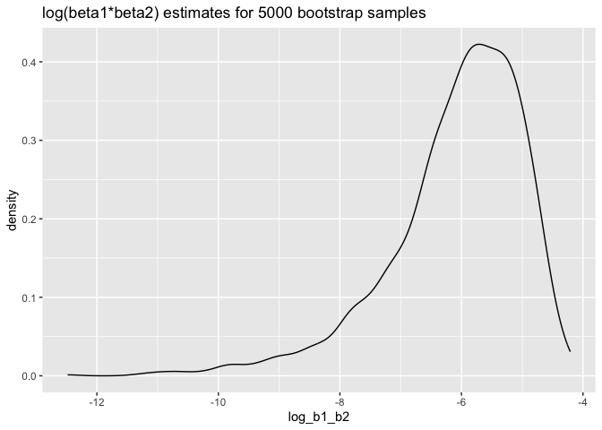

p8105_hw6_mf3593
================
Miao Fu
2023-11-28

## Problem 1

``` r
homicide=read.csv("homicide-data.csv",na = c("", "NA", "Unknown"))|>
  janitor::clean_names()|>
  mutate(city_state=paste0(city," , ",state),
         homicide_bin=ifelse(disposition=="Closed by arrest",1,0),
         victim_age=as.numeric(victim_age))|>
  filter(!city_state%in%c("Dallas , TX","Phoenix , AZ", "Kansas City , MO", "Tulsa , AL"),
         victim_race%in%c("White","Black"))|>
  select(city_state, homicide_bin, victim_age, victim_sex, victim_race)


homicide|>
  filter(city_state==("Baltimore , MD"))|>
  glm(homicide_bin ~ victim_age+victim_sex+victim_race,data=_,family=binomial())|>
  broom::tidy()|>
  mutate(
    OR=exp(estimate),
    OR_CI_upper = exp(estimate + 1.96 * std.error),
    OR_CI_lower = exp(estimate - 1.96 * std.error)) |> 
  filter(term == "victim_sexMale") |> 
  select(OR, OR_CI_lower, OR_CI_upper) |>
  knitr::kable(digits = 3)
```

|    OR | OR_CI_lower | OR_CI_upper |
|------:|------------:|------------:|
| 0.426 |       0.325 |       0.558 |

``` r
homicide|>
  nest(data=-city_state)|>
  mutate(
    model = map(data,\(df) glm(homicide_bin ~ victim_age+victim_sex+victim_race,data=df,family=binomial())),
    results = map(model, broom::tidy))|>
  select(-data, -model)|> 
  unnest(results)|>
  mutate(
    OR=exp(estimate),
    OR_CI_upper = exp(estimate + 1.96 * std.error),
    OR_CI_lower = exp(estimate - 1.96 * std.error)) |> 
  filter(term == "victim_sexMale") |> 
  select(city_state, OR, OR_CI_lower, OR_CI_upper)|>
  mutate(
    city_state = fct_reorder(city_state, OR))|>
  ggplot(aes(x=city_state,y=OR))+
  geom_point()+
  geom_errorbar(aes(ymin = OR_CI_lower, ymax = OR_CI_upper)) + 
  theme(axis.text.x = element_text(angle = 90, hjust = 1))
```

<!-- -->

The odds ratio are overall low (0-2) for all cities. It means male
victims has a lower chance of having case closed compared to other sex
in most cities. New York has the smallest odds ratio. CI are mostly
narrow, suggesting the difference in resolution of case between sexes is
significant.

## Problem 2

``` r
set.seed(1)

weather_df = 
  rnoaa::meteo_pull_monitors(
    c("USW00094728"),
    var = c("PRCP", "TMIN", "TMAX"), 
    date_min = "2022-01-01",
    date_max = "2022-12-31") |>
  mutate(
    name = recode(id, USW00094728 = "CentralPark_NY"),
    tmin = tmin / 10,
    tmax = tmax / 10) |>
  select(name, id, everything())

boot_sample = function(df) {
  sample_frac(df, replace = TRUE)
}

boot_straps = 
  tibble(strap_number = 1:5000) |> 
  mutate(
    strap_sample = map(strap_number, \(i) boot_sample(df = weather_df))
  )

log_multiple=boot_straps|>
  mutate(
    models=map(strap_sample,\(df) lm(tmax~tmin+prcp,data=df)),
    results=map(models,broom::tidy)
  )|>
  select(-strap_sample,-models)|>
  unnest(results)|>
  select(strap_number,term,estimate)|>
  filter(term %in% c("tmin","prcp"))|>
  group_by(strap_number)|>
  summarise(log_b1_b2=log(prod(estimate)))

log_multiple|>
  summarise(count=sum(is.na(log_b1_b2)),
            n=n(),
            frac=count/n())|>
  knitr::kable()
```

| count |    n |   frac |
|------:|-----:|-------:|
|  3361 | 5000 | 0.6722 |

``` r
R=boot_straps|>
  mutate(
    models=map(strap_sample,\(df) lm(tmax~tmin+prcp,data=df)),
    results=map(models,broom::glance)
  )|>
  select(-strap_sample,-models)|>
  unnest(results)|>
  select(strap_number,r.squared)

combined=R|>
  full_join(log_multiple)

combined|>
  ggplot(aes(x=r.squared))+
  geom_density()+
  labs(
    title="r.squared estimates for 5000 bootstrap samples"
  )
```

<!-- -->

``` r
combined|>
  ggplot(aes(x=log_b1_b2))+
  geom_density()+
  labs(
    title="log(beta1*beta2) estimates for 5000 bootstrap samples"
  )
```

<!-- -->

``` r
quantile_r=quantile(pull(combined,r.squared),c(0.025,0.975))
quantile_log=quantile(pull(combined,log_b1_b2),c(0.025,0.975),na.rm=TRUE)
```

The distribution of $\hat r^2$ has peak around 0.92 and is left-tailed.
Since majority of the data has r_squared value closer to 1 and the 95%
CI for r_squared is (0.889,0.941), indicating that tmin and prcp well
explained the proportion of variance in tmax. The distribution of
$log(\hat {\beta_1}\cdot\hat {\beta_2})$ has peak around -6 and is
left-tailed. There are 3361 NaN values due to negative products of
$\beta_1$ and $\beta_2$ corresponding to a portion of 67% of the entire
5000 bootstrap samples. Using the remaining estimates, we see all of the
log values are negative and the 95% CI for log_b1_b2 is (-8.98,-4.6),
implying the estimated product of the coefficients is less than 1. The
negative interaction suggests that the join effect of tmin and prcp on
tmax is smaller than the product of their individual effects.

## Problem 3

``` r
child_bw=read.csv("birthweight.csv")|>
  janitor::clean_names()|>
  mutate(
    babysex=case_match(
      babysex,
      1~"male",
      2~"female"
    ),
    frace=case_match(
      frace,
      1~"White",
      2~"Black",
      3~"Asian",
      4~"Puerto Rican",
      8~"Other",
      9~"Unknown"
    ),
    malform=case_match(
      malform,
      0~"absent",
      1~"present"
    ),
    mrace=case_match(
      mrace,
      1~"White",
      2~"Black",
      3~"Asian",
      4~"Puerto Rican",
      8~"Other",
      9~"Unknown"
    )
  )|>
  na.omit(df)|>
  mutate(
    babysex=as.factor(babysex),
    frace=as.factor(frace),
    malform=as.factor(malform),
    mrace=as.factor(mrace)
  )
```

I would propose a multiple linear regression model for birth weight.  
Hypothesis: Child birth weight is affected by babysex, gestational age
in weeks, and presence of malformations that could affect weight.

``` r
linear_mod = lm(bwt ~ babysex+gaweeks+malform, data = child_bw)
child_bw |> 
  add_predictions(linear_mod) |> 
  add_residuals(linear_mod)|>
  ggplot(aes(x = pred, y = resid)) + 
  geom_point()+
  labs(
    title="Residuals against fitted values",
    x="fitted values",
    y="residuals"
  )
```

<!-- -->

Based on the variables, I think babysex, gestational age and
malformations that may affect baby birth weight are potential predictors
for the baby birth weight. Thus, I made a multiple linear regression
model using those as predictors.

``` r
set.seed(2)
cv_df=
  crossv_mc(child_bw,100)

cv_df=cv_df|>
  mutate(
    train=map(train,as_tibble),
    test=map(test,as_tibble)
  )

cv_df = 
  cv_df |> 
  mutate(
    my_mod  = map(train, \(df) lm(bwt ~ babysex+gaweeks+malform, data = df)),
    alt_mod_1  = map(train, \(df) lm(bwt ~ blength+gaweeks, data=df)),
    alt_mod_2  = map(train, \(df) lm(bwt ~ bhead*blength*babysex, data=df))) |> 
  mutate(
    rmse_my_mod = map2_dbl(.x=my_mod, .y=test, ~rmse(model = .x, data = .y)),
    rmse_alt_mod_1 = map2_dbl(.x=alt_mod_1, .y=test, ~rmse(model = .x, data = .y)),
    rmse_alt_mod_2 = map2_dbl(.x=alt_mod_2, .y=test, ~rmse(model = .x, data = .y)))

cv_df |> 
  select(starts_with("rmse")) |> 
  pivot_longer(
    everything(),
    names_to = "model", 
    values_to = "rmse",
    names_prefix = "rmse_") |> 
  mutate(model = fct_inorder(model)) |> 
  ggplot(aes(x = model, y = rmse)) + geom_violin()
```

<!-- -->

According to the cross validation, alternative model 2 which is “model
using head circumference, length, sex, and all interactions (including
the three-way interaction) between these” is the best model. Alternative
model 2 has the smallest rmse which means it provides the most accurate
predictions compared to my model and alternative model 1. However,
alternative model 2 also has a wide span, which means that its
performance is variable across different folds or datasets.
